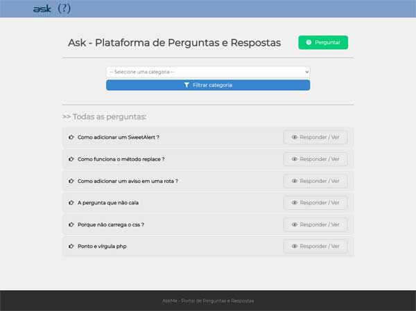
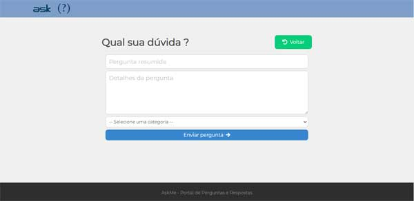
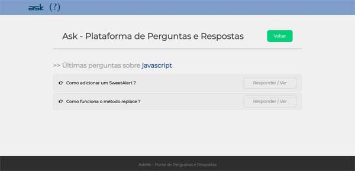
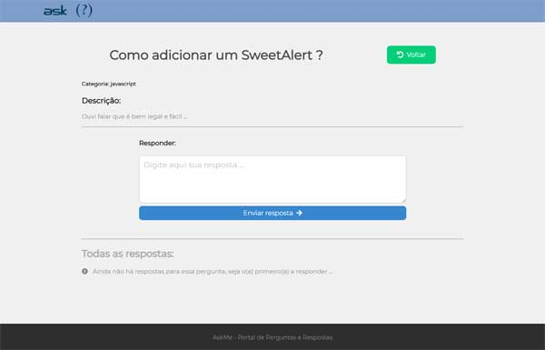
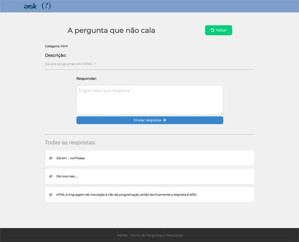

# askme
Q &amp; A platform

# About

A simple question and answer platform application that was proposed in a training and improved in this version, with many new features implemented.

We used several very interesting resources that are used in various applications by many companies.

Features such as:
- Validations
- Elegant notices via SweetAlert
- Layout improvements
- Option to filter by question category

among others

See the screen layouts below and their respective utilities

# Layout and features

Home page, lists existing questions, has category filter button for new question and button to answer existing question

Add new question

Question successfully added with SweetAlert animated

Questions filtered by a category

Answer page for an unanswered question

Answer page for a question with list of published answers

SweetAlert notifying you that the selected category does not yet have questions posted and gives you the option to go straight to the questions page

# Technologies

- HTML5
- CSS3
- nodeJS
- Sequeilize
- Express
- EJS
- Font Awesome
- Javascript
- Mysql ( workbench )
- SweetAlert

# Author

- Marcelo Paiva

http://codewave.com.br
